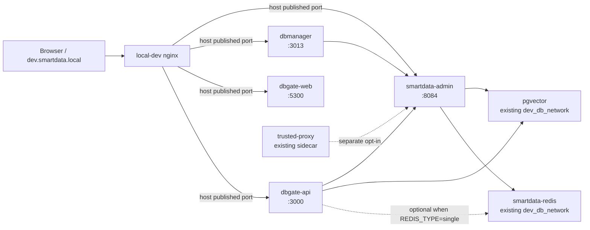

# Containerize the four SmartData `make dev` services

## Overview

Move the four processes currently launched by SmartData `make dev` into the
SmartData product stack under `local-dev/smartdata/`:

1. SmartData admin (`8084`)
2. dbmanager (`3013`)
3. dbgate-api (`3000`)
4. dbgate-web (`5300`)

The existing Trusted Proxy service is already containerized in this directory
and is outside this migration because it is an opt-in sidecar, not part of
`make dev`.

The first slice reuses the existing PostgreSQL and Redis containers managed by
`local-dev`. They are already attached to the external `dev_db_network`, so
the four new application services should join that network and use container
DNS (`pgvector:5432` and `smartdata-redis:6379`) rather than routing through
the host-published ports. This limits the change to the four development
processes without changing the database dependency topology.

## Requirements trace

The current source of truth is `../smartdata/Procfile.dev` and the service
targets in `../smartdata/Makefile`:

| Service | Current command | Canonical port | Container acceptance gate |
|---|---|---:|---|
| SmartData admin | Maven reactor build, then the admin jar with `dev` profile | 8084 | Actuator liveness plus DB/Redis-backed login/API smoke |
| dbmanager | `pnpm dev` | 3013 | Vite page, HMR/file change, API proxy to admin |
| dbgate-api | `yarn start:api` | 3000 | API listener, configured environment, request reaching admin |
| dbgate-web | `yarn workspace dbgate-web sirv public --cors --host --port 5300 --dev` | 5300 | Static editor page and API/terminal route through nginx |

The existing `nginx/conf.d/default.conf` already exposes these services using
the canonical host ports. The final Compose stack should continue publishing
those ports so the public local URL does not change.

## Scope boundaries

In scope:

- Compose service definitions and development images under `smartdata/`.
- Bind-mounted source checkouts and named dependency caches.
- Explicit environment-file contracts for the three repositories.
- A stable `smartdata-redis` network alias in the existing single-Redis
  Compose recipe; this changes only network metadata, not the Redis image,
  data volume, or topology.
- Per-service startup, logs, restart, and validation commands.
- A staged container entry point owned entirely by `local-dev`.
- Documentation and topology checks in `local-dev`; the existing SmartData
  source-repository `make dev` remains unchanged.

Out of scope for this migration:

- Changing the existing PostgreSQL/Redis images, data volumes, or database
  topology under `db/` and `redis/`; the single Redis recipe's explicit
  network alias is the one permitted metadata-only exception.
- Changing production Dockerfiles, CI images, or release packaging.
- Refactoring application code merely to accommodate the container.
- Removing or changing the host-development workflow.
- Moving the already-migrated Trusted Proxy into the four-service lifecycle.

## Context and research

The repository inspection established the following facts:

- `make dev` is a tmux four-pane launcher; the exact commands are in
  `../smartdata/Procfile.dev` and `../smartdata/Makefile`.
- `smartdata/compose.yaml` already demonstrates the required bind-mounted
  SmartData source, Maven cache, host gateway, TLS file mounts, and healthcheck
  pattern for Trusted Proxy.
- The active development dependencies are containers: `db/pgvector` runs as
  `pgvector` on `dev_db_network` with host port `5433` mapped to container
  port `5432`, and `redis/single` runs on the same network with port `6379`.
  The generated container name `redis-service-1` is not used as an
  application contract; the migration adds the explicit `smartdata-redis`
  network alias.
- dbmanager requires Node 18.18+/20.9+, pnpm 9.1.2, Vite bound to
  `0.0.0.0`, and supports file polling for Docker Desktop through its Vite
  configuration.
- dbgate uses Yarn 1.22.22 workspaces. The API package's `start` script loads
  `.env.local` through `env-cmd`, while the web pane serves the existing
  `public` directory with `sirv`. The containerized web service follows the
  same artifact boundary as `make dev`: `yarn build:web` runs on the host and
  the container only serves the resulting `packages/web/public` directory.
  The API container must make its environment source explicit rather than
  accidentally letting a mounted local file override Compose values.
- SmartData admin reads development DB/Redis settings from environment
  variables and exposes actuator health endpoints. Its database encryption key
  is required by admin and must remain available to this service. It must not
  be copied into tracked Compose files or into the Trusted Proxy container.
- The current dbgate API local env uses host-oriented values (`localhost`,
  host PostgreSQL port, and a loopback SmartData URL). Those values must be
  overridden by the container service contract; mounting the existing file
  alone is not sufficient.
- No relevant reusable solution document was found in the local learning
  catalogue; external research is unnecessary because the three repositories
  already provide the runtime and Docker conventions needed here.

## Key technical decisions

1. **One product Compose file, selective service startup.** Extend
   `smartdata/compose.yaml` with the four services, but migrate and start them
   one at a time (`docker compose up dbgate-web`, then API, dbmanager, and
   admin). The local-dev make target starts the explicit four-service list;
   the existing Trusted Proxy service remains independently startable and is
   not pulled into the four-service lifecycle.
2. **Reuse the existing database network.** Attach the product Compose stack
   to the external `dev_db_network`. SmartData admin uses `pgvector:5432` and
   `smartdata-redis:6379`; the host-published `5433`/`6379` ports remain for
   host tools and fallback processes. The network must exist before the
   product stack starts, and the dependency containers must be reachable and
   ready before the application start command proceeds.
3. **Keep host ports configurable.** Defaults remain `8084`, `3013`, `3000`,
   and `5300`; temporary alternate host ports are available for side-by-side
   checks. Never run a host process and its container on the same port.
4. **Use the product Compose network for migrated-to-migrated calls.** During the
   hybrid phases, callers use `host.docker.internal` for the still-hosted
   admin. After admin is migrated, dbmanager and dbgate-api use the Compose
   service name for admin-to-service traffic. The nginx container continues to
   use the existing `host.docker.internal` upstreams, so the four application
   services publish their canonical host ports and the local-dev preflight
   verifies that nginx can reach them. `host.docker.internal` is only the
   ingress/hybrid/control-plane bridge, not the database dependency path.
5. **Keep secrets outside the repository.** `.env.example` documents variable
   names and file locations only. Admin and dbgate-api receive their existing
   local secret files through explicitly configured `env_file` paths or
   Compose secrets; the admin `DB_ENCRYPT_KEY` and dbgate-api `DB_ENCRYPT_KEY`
   are intentionally separate from the Trusted Proxy environment contract.
6. **Keep dependency installs out of source mounts.** Use named volumes for
   Maven, pnpm, Yarn, and `node_modules` state so bind mounts contain source
   changes but do not replace Linux-native dependencies with host-native
   artifacts.
7. **Keep the two development modes independent.** The existing
   `../smartdata/make dev` remains the host/tmux workflow. The containerized
   equivalent is exposed only through `local-dev/makefile`; neither command
   delegates to or replaces the other.

## Target topology

During the staged migration, the four application nodes are mixed between
Compose and host processes. The dependency arrows must be tested in both
hybrid and final all-container modes.

## Implementation units

### U1. Establish the four-service Compose contract

Files:

- `smartdata/compose.yaml`
- `smartdata/.env.example`
- `smartdata/.gitignore`
- `smartdata/README.md`
- `redis/single/docker-compose.yml`
- `README.md`
- `makefile`

Work:

- Add source-directory variables for SmartData, dbmanager, and dbgate, plus
  independent host-port variables.
- Keep the existing Trusted Proxy service behavior unchanged.
- Add the `smartdata-redis` network alias to the existing single-Redis service
  without changing its image, volume, port, or data topology.
- Attach the product services to the existing external `dev_db_network`, and
  add `extra_hosts` only for hybrid admin/control-plane calls. Keep the
  existing nginx host-gateway path for the canonical published application
  ports. Include restart/logging defaults and service-level health/startup
  checks.
- Add a preflight that checks the external network, resolves `pgvector` and
  `smartdata-redis`, and confirms PostgreSQL/Redis readiness before starting
  the application services. Fail with an actionable message if the selected
  database/Redis stack is absent or not ready.
- Define external env-file variables without checking in secret values.
- Define the first-install behavior for Yarn and pnpm volumes; an empty
  named `node_modules` volume must trigger a lockfile-respecting install
  before the dev process starts.
- Add local-dev wrappers for `smartdata-up`, `smartdata-down`,
  `smartdata-logs`, and `smartdata-config`; allow a `SERVICE` argument for
  staged startup. With no `SERVICE`, `smartdata-up` starts exactly
  `smartdata-admin dbmanager dbgate-api dbgate-web`; Trusted Proxy remains an
  explicit separate target.
- Document that the old `local-dev/dbmanager/` directory is gone while the
  sibling `../dbmanager` source checkout remains the bind-mount source.
- Correct the existing Trusted Proxy README wording to distinguish the Redis
  container from the host-gateway access path.

Validation:

- `docker compose --env-file .env config --quiet`.
- `docker compose --env-file .env config --services` lists all five product
  services, including the existing Trusted Proxy.
- The default local-dev target expands to the four application services only;
  a separate explicit target is required for Trusted Proxy.
- `redis-service-1` is not used as a contract; `smartdata-redis` resolves on
  `dev_db_network` after the Redis service is recreated with the alias.
- `make check-topology` and `git diff --check` pass.

### U2. Migrate dbgate-web first

Files:

- `smartdata/compose.yaml`
- `smartdata/.env.example`
- `smartdata/README.md`

Work:

- Keep web compilation on the host, using the existing `yarn build:web` command
  from the dbgate checkout, just as `make dev` assumes the `public` artifact is
  already present.
- Run a minimal static web container and read-only bind-mount
  `../dbgate/packages/web/public` into it. Publish the container's HTTP port
  on host port `5300`; do not mount web `node_modules` or run Yarn in this
  container.
- Publish a configurable host port and validate through both direct HTTP and
  the existing nginx `/dbgatex/` routing through the published host port.

Gate:

- The container stays up after the host rebuilds `packages/web/public`.
- `dev.smartdata.local/dbgatex/` renders and its configured API base remains
  `/dbgatex/api`.
- Stopping the container restores the host web pane without file or port
  residue.

### U3. Migrate dbgate-api

Files:

- `smartdata/Dockerfile.node-yarn.dev`
- `smartdata/compose.yaml`
- `smartdata/.env.example`
- `smartdata/README.md`

Work:

- Reuse the Yarn development image and source/node_modules volumes.
- Inject the dbgate API environment explicitly from a caller-selected local
  env file. Do not invoke the package `start` script blindly because it loads
  `.env.local` through `env-cmd`; run the equivalent direct Node watch command
  once Compose owns the environment. Run the lockfile-respecting `yarn
  install --ignore-scripts` before the first start when the named dependency
  volume is empty; the API's Java-gateway development mode does not require
  the platform-specific DB2/Oracle/SQLite install hooks.
- Set `PORT=3000`, preserve the API's `DB_ENCRYPT_KEY` contract, and override
  the Java Gateway host from the sibling `.env.local` (whose host-mode default
  is `localhost`). The API's `ONLINE_ADMIN_API` is used for admin/license
  calls, while `JAVA_GATEWAY_HOST` is the SQL/editor upstream; both must select
  the same admin process in each mode. Use this explicit upstream matrix:

  | Mode | `ONLINE_ADMIN_API` | `JAVA_GATEWAY_HOST` / `JAVA_GATEWAY_PORT` | `DB_HOST` / `DB_PORT` |
  |---|---|---|---|
  | Hybrid API container + host admin | `http://host.docker.internal:8084` | `host.docker.internal` / `8084` | `pgvector` / `5432` |
  | All-container | `http://smartdata-admin:8084` | `smartdata-admin` / `8084` | `pgvector` / `5432` |

  Preserve the current `REDIS_TYPE=none` behavior unless the selected local
  env explicitly enables Redis. When it is `single`, use
  `smartdata-redis:6379`; never use `localhost` or the host-mapped `5433`
  from inside the API container.
- Add a startup/TCP check and a request smoke test for an existing API route;
  do not invent a new application health endpoint as part of this migration.

Gate:

- The API starts without missing environment or native-module errors.
- API database initialization reaches `pgvector:5432`; if
  `REDIS_TYPE=single`, Redis initialization reaches `smartdata-redis:6379`.
- A representative API request reaches the correct SmartData admin in the
  hybrid phase, and the same request reaches `smartdata-admin` after U5.
- The dbgate web container can use the API through nginx, including the
  terminal websocket route.

### U4. Migrate dbmanager

Files:

- `smartdata/Dockerfile.node-pnpm.dev`
- `smartdata/compose.yaml`
- `smartdata/.env.example`
- `smartdata/README.md`

Work:

- Build a Node 20 development image with pnpm 9.1.2.
- Bind-mount `../dbmanager`, keep `node_modules` and the pnpm store in named
  volumes. Run `pnpm install --frozen-lockfile` when the named dependency
  volume is empty, then run the existing `pnpm dev` command with Vite bound
  to `0.0.0.0:3013`.
- Make the Vite API target explicit. It uses the host admin during hybrid
  testing and the Compose admin service after U5.
- Enable polling only when needed for Docker Desktop file sharing; expose
  HMR host/client-port settings as variables rather than hardcoding a host
  LAN address.

Gate:

- `/db/` renders through nginx.
- A source edit is reflected without reinstalling dependencies.
- Login/API proxy traffic reaches the expected SmartData admin endpoint.

### U5. Migrate SmartData admin last

Files:

- `smartdata/compose.yaml`
- `smartdata/.env.example`
- `smartdata/README.md`

Work:

- Reuse the existing Maven/Java 11 development image pattern and Maven cache
  volume used by Trusted Proxy.
- Bind-mount the selected SmartData checkout and run the same reactor build
  and admin jar command as `make dev`, with `-DskipTests` so required test-jars
  are packaged, plus `--spring.profiles.active=dev`.
- Pass DB host/port/name/user/password as `pgvector:5432`, Redis host/port as
  `smartdata-redis:6379`, the Redis password, and `DB_ENCRYPT_KEY` through the
  admin-only env contract. Keep host-published `5433` only for host-mode
  fallback.
- Mount only the host TLS files and development state directories required by
  the admin profile, with an explicit path contract:

  | Host input | Container setting/path | Mode |
  |---|---|---|
  | `SMARTDATA_AUTH_RSA_DIR` | `AUTH_RSA_KEY_DIR=/run/smartdata/auth-rsa` | read-only |
  | `SMARTDATA_ONTOLOGY_DIR` | `ONTOLOGY_REPO_PATH=/run/smartdata/ontology` | read-write if the app commits ontology changes |
  | `TRUSTED_PROXY_DEV_TLS_DIR` | release server cert/key and client CA under `/run/smartdata/trusted-proxy` | read-only |
  | `SMARTDATA_LOG_DIR` | `LOG_PATH=/data/smartdata/logs` | writable volume/bind mount |

  Do not rely on `${user.home}` inside the container. Fail before startup if
  required RSA, ontology, or release TLS inputs are missing.
- Keep the Trusted Proxy release connector's certificate paths and the
  `DB_ENCRYPT_KEY` exclusion isolated from the Trusted Proxy service.
- Add actuator liveness/readiness checks and preserve the existing local port
  `8084`.
- Bound Maven and runtime Java memory for the local Docker budget. Provide an
  explicit `SMARTDATA_SKIP_BUILD=true` recovery switch that starts an existing
  admin jar without rerunning the full reactor when Docker has insufficient
  memory for a cold build.

Gate:

- The admin image builds from a clean dependency cache and restarts after a
  source change.
- Actuator liveness is `UP`.
- Admin login, DB-backed metadata, Redis-backed behavior, and the existing
  Trusted Proxy release path all work from the container.
- dbmanager and dbgate-api can switch from host gateway to the Compose admin
  service name without changing browser URLs.

### U6. Complete the local-dev container workflow

Files:

- `smartdata/compose.yaml`
- `smartdata/README.md`
- `README.md`
- `makefile`
- `nginx/conf.d/default.conf` only if routing or websocket behavior requires
  a change after the container acceptance run

Work:

- Add `smartdata-up`, `smartdata-down`, `smartdata-restart`,
  `smartdata-logs`, and `smartdata-config` targets to the `local-dev`
  makefile. Support `SERVICE=<name>` for staged startup and per-service
  troubleshooting. With no service argument, start exactly
  `smartdata-admin dbmanager dbgate-api dbgate-web`; use a separate explicit
  target for Trusted Proxy.
- Keep the existing SmartData `make dev` host/tmux workflow untouched. The
  two workflows have separate start/stop commands and are never started
  concurrently on the same published ports.
- Keep `nginx/conf.d/default.conf` on its current host-gateway upstreams for
  this first slice; the four app containers publish the canonical ports that
  nginx already targets. Validate reachability from the nginx container, not
  only from the host browser.
- Update local-dev's topology table and operational commands after the final
  port ownership is confirmed.

Final acceptance:

- One `local-dev/make smartdata-up` command starts exactly the four services
  and one command stops them; Trusted Proxy is not started implicitly.
- `docker compose ps smartdata-admin dbmanager dbgate-api dbgate-web` shows
  all four services healthy or running with the
  documented health limitation for dbgate-api.
- `curl`/browser checks cover ports `8084`, `3013`, `3000`, `5300`, nginx
  `/db/`, `/dbapi/`, `/dbgatex/`, and `/dbgatex/api/terminal`.
- Host-mode `make dev` starts cleanly after `docker compose down`.
- `make check-topology`, Compose config validation, nginx-from-container
  reachability, and relevant source-repo build/type checks pass.

## System-wide impact

| Area | Impact | Mitigation |
|---|---|---|
| Port ownership | Host `make dev` and Compose cannot run concurrently on the same four application ports | Add explicit stop/start commands and configurable temporary host ports |
| Secrets | Admin and dbgate-api need local secret files; Compose `env_file` values are visible to the container and can be exposed by careless inspect/log commands | Keep files local with restrictive permissions, use caller-selected paths, redact diagnostics, and never print `docker compose config` with values |
| Native dependencies | dbgate optional native packages can differ between host and Linux container | Install inside named container volumes and record any architecture failure in the service gate |
| File watching | Bind mounts may miss events on Docker Desktop | Use Vite/Node polling variables as an opt-in fallback |
| Service discovery | Application services use Compose DNS; nginx and hybrid admin/control-plane calls use the host gateway | Make upstream URLs explicit per phase and smoke-test both modes |
| Dependency network | Product services must join the already-existing `dev_db_network` | Add a preflight and verify `pgvector:5432`/`smartdata-redis:6379` from the containers |
| Nginx | It currently targets canonical host ports through `host.docker.internal` | Keep the existing upstreams, publish canonical container ports, and test reachability from nginx |
| Host exposure | Published app ports must be reachable by the nginx container and may be visible on the Docker host network | Document this as a local-development-only binding and verify the developer's firewall/port ownership before startup |
| Developer ergonomics | Logs move from tmux/`/tmp/hivemind` to Compose logs | Provide `smartdata-logs` and per-service log commands; keep source Makefile host targets during transition |

## Phased delivery and rollback

1. Land U1 and validate Compose topology, dependency readiness, and the
   four-service-only local-dev target without changing the host workflow.
2. Start only dbgate-web in a container; rollback with `docker compose rm -sf
   dbgate-web` and the existing host pane.
3. Add dbgate-api, then dbmanager; each stage stops only the matching host
   pane before claiming its canonical port.
4. Stop the host SmartData admin before claiming `8084`, start U5, and switch
   the two callers to Compose DNS after admin health passes.
5. Run the full browser/API matrix, then document the two independent
   development entry points without changing the SmartData `make dev`
   implementation.
6. If any gate fails, run `docker compose down`, restore the host panes, and
   leave the failed service in its explicit container target for diagnosis.

## Documentation and operational notes

- Keep `smartdata/.env.example` as the checked-in variable contract; `.env`
  and service env files remain local-only.
- Document `make smartdata-up` as the four-service container entry point;
  direct `docker compose up` remains a lower-level operation and must not be
  presented as the default because the same Compose file also contains the
  independent Trusted Proxy service.
- Document the required Docker Desktop file-sharing paths for the three
  sibling source repositories.
- Record container names, published ports, cache volumes, and the exact
  host/Compose upstream selection in `smartdata/README.md`.
- Clearly label `../smartdata/make dev` as host/tmux mode and
  `local-dev/make smartdata-up` as container mode; neither is a wrapper
  around the other.
- Do not reintroduce a product backend or license directory under
  `local-dev/dbmanager`; the sibling repository remains the source mount.
